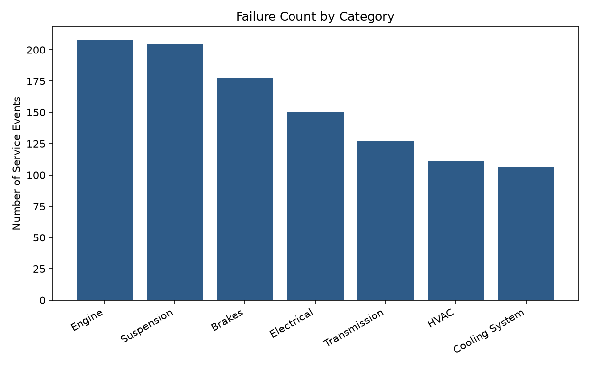
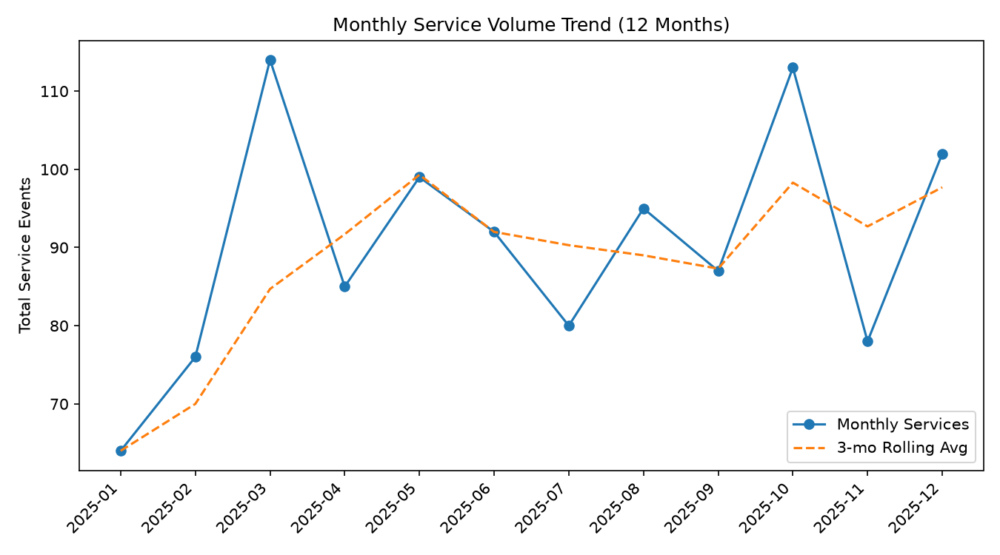
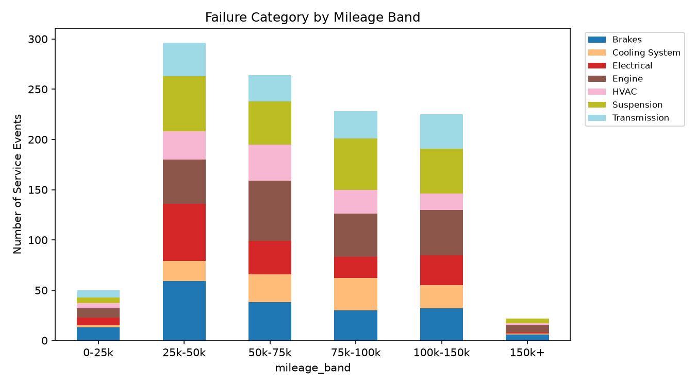
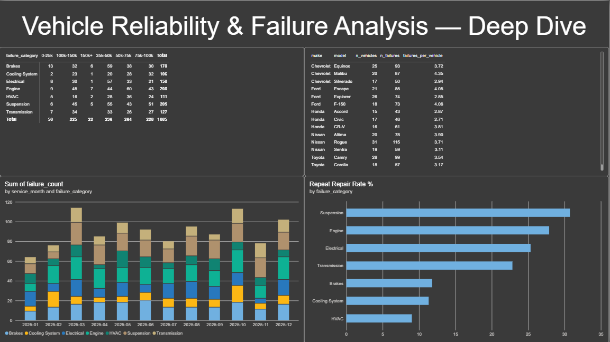
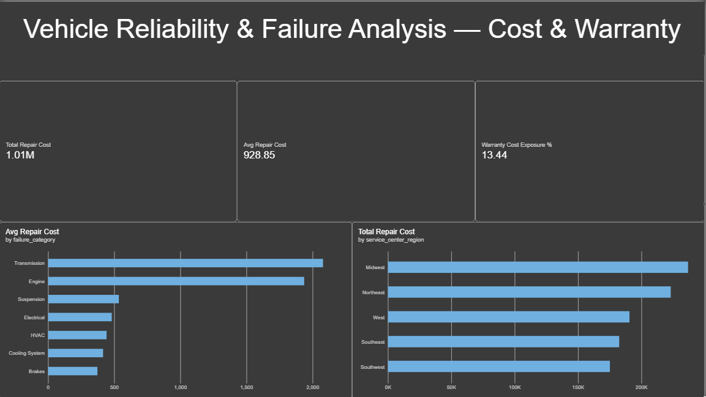

# Vehicle Reliability & Failure Analysis

A personal project analyzing a synthetic vehicle-service dataset to surface
failure patterns, repeat-repair behavior, and mileage-related reliability
trends — built with **Python (pandas)**, **SQL**, and **Power BI**.

> **Note:** the dataset is synthetically generated (see
> `scripts/generate_data.py`) to resemble real automotive field-reliability
> data, since no real service records are used.

## What this project does

- Generates a **1,000+ record** synthetic vehicle-service dataset spanning
  **12 monthly service periods**, across **5 makes / 15 models** and
  **7 failure categories** (Engine, Transmission, Brakes, Electrical,
  Suspension, HVAC, Cooling System).
- Loads the data into **SQLite** and runs SQL analysis using **CTEs and
  window functions** (`LAG`, rolling averages) to detect repeat repairs and
  compute monthly trend statistics.
- Runs a parallel **pandas** analysis pipeline that performs the same
  repeat-repair detection, mileage-band bucketing, and time-series /
  trend analysis (month-over-month % change, 3-month rolling average).
- Feeds the resulting summary tables into a **Power BI dashboard** with
  10+ KPIs modeled on field-reliability reporting (failure counts,
  repeat-repair rate, mileage-band breakdowns, monthly trend lines,
  warranty cost exposure, model-level reliability ranking).

## Repo structure

vehicle-reliability-analysis/
├── data/
│ ├── raw/
│ │ └── vehicle_service_data.csv <- generated dataset (1,000+ rows)
│ └── processed/
│ ├── vehicle_reliability.db <- SQLite DB
│ ├── fact_table_enriched.csv <- + is_repeat_repair flag
│ ├── summary_category.csv
│ ├── summary_monthly_trend.csv
│ ├── summary_monthly_by_category.csv
│ ├── summary_mileage_band.csv
│ └── summary_model_reliability.csv
├── sql/
│ ├── schema.sql
│ └── analysis_queries.sql <- CTEs, window functions
├── scripts/
│ ├── generate_data.py
│ ├── load_to_sql.py
│ └── analysis.py
├── outputs/
│ └── charts/ <- PNG charts from pandas/matplotlib
├── powerbi/
│ ├── POWER_BI_GUIDE.md <- exact dashboard build steps
│ ├── vehicle_reliability_dashboard.pbix
│ └── screenshots/
│ ├── overview.png
│ ├── deep_dive.png
│ └── cost_warranty.png
├── requirements.txt
└── README.md


## How to run it

```bash
# 1. Clone and set up environment
git clone https://github.com/<your-username>/vehicle-reliability-analysis.git
cd vehicle-reliability-analysis
python3 -m venv venv
source venv/bin/activate        # Windows: venv\Scripts\activate
pip install -r requirements.txt

# 2. Generate the synthetic dataset
python scripts/generate_data.py

# 3. Load it into SQLite
python scripts/load_to_sql.py

# 4. Run SQL analysis (optional, or open the .db in DB Browser for SQLite)
sqlite3 data/processed/vehicle_reliability.db < sql/analysis_queries.sql

# 5. Run the pandas analysis pipeline (produces summary CSVs + charts)
python scripts/analysis.py
```

Then follow `powerbi/POWER_BI_GUIDE.md` to build the dashboard from the
CSVs in `data/processed/`.

## Dashboard & Visuals

**Failure counts by category**


**Monthly service volume trend**


**Failure category by mileage band**


**Power BI Dashboard — Overview**


**Power BI Dashboard — Deep Dive**


**Power BI Dashboard — Cost & Warranty**


## Key findings (from the generated dataset)

- **1,085** service records across **309** unique vehicles.
- **7** distinct failure categories, full **12-month** coverage.
- Overall **repeat-repair rate: ~21%** (same vehicle + same failure
  category returning within 90 days) — detected independently via both a
  SQL `LAG()` window function and a pandas `groupby().shift()` approach,
  cross-validated to the same result.
- **Engine** and **Suspension** are the most frequent failure categories;
  **Suspension** has the highest repeat-repair rate.
- Failure mix shifts measurably with mileage band — Engine, Transmission,
  Suspension, and Cooling System failures skew toward higher-mileage
  vehicles, as expected physically, and the dataset generation logic makes
  this recoverable from the data rather than hardcoded.
- Monthly service volume shows meaningful month-over-month variation, with
  a 3-month rolling average used to separate trend from noise.

*(Exact numbers will vary slightly if you regenerate the dataset with a
different random seed — see `SEED` in `generate_data.py`.)*

## Tech stack

- **Python**: pandas, numpy, matplotlib
- **SQL**: SQLite (CTEs, window functions, views)
- **Power BI**: Power Query, DAX measures, time-intelligence, matrix/line/
  bar visuals

## Methodology notes / limitations

- This is a **synthetic** dataset built to exhibit realistic reliability
  patterns (mileage-dependent failure probability, genuine repeat-repair
  chains) rather than random noise — but it is not real fleet data, and
  absolute numbers shouldn't be read as claims about any real vehicle
  make/model's reliability.
- Repeat-repair detection uses a 90-day window on (vehicle, failure
  category) pairs; this threshold is a modeling choice and can be tuned in
  both `sql/analysis_queries.sql` and `scripts/analysis.py`.